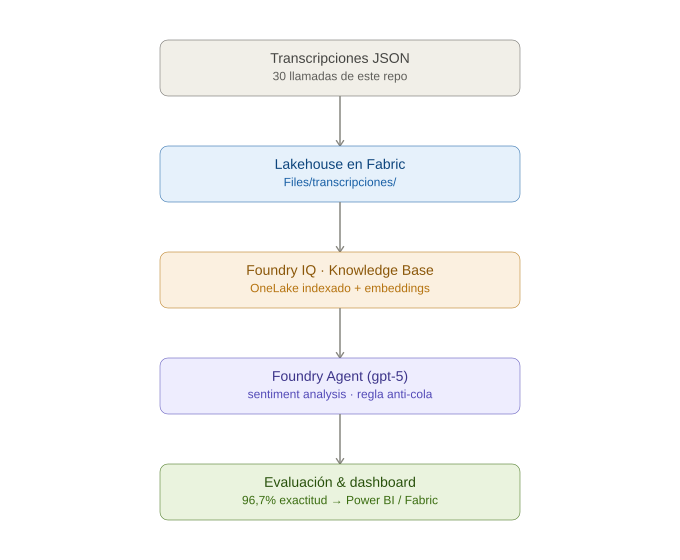

<div align="center">

# 🌮 Laboratorio Fabric + Foundry con GitHub Copilot
### "México Lindo" — del dashboard de ventas al agente de análisis de sentimiento


</div>

Ejercicio hands-on de **2 horas** que recorre el ciclo completo de una solución
de datos + IA sobre la cadena ficticia de restaurantes **México Lindo**, usando
**lenguaje natural (GitHub Copilot)** como acelerador:

- **Parte A — Fabric App.** Construyes un **dashboard de ventas** en
  **Microsoft Fabric Apps** (plantilla *Data App*) que Copilot conecta a un
  **modelo semántico** publicado en Fabric, sin escribir DAX ni código de
  autenticación a mano.
- **Parte B — Foundry Agent.** Cargas transcripciones sintéticas de llamadas de
  servicio al cliente, las expones como **Knowledge Base en Foundry IQ**, y
  creas un **Foundry Agent** (`gpt-5`) que hace **análisis de sentimiento** con
  grounding sobre esas transcripciones y lo evalúas contra un ground truth.

La narrativa que amarra las dos partes es **dev-time + run-time**: GitHub
Copilot **acelera a quien construye** la solución (Parte A y Parte B), y el
Foundry Agent **ejecuta** la inteligencia en producción. Microsoft cubre el
ciclo completo.

> ⚠️ **Nota de vigencia:** Fabric Apps y Rayfin están en **preview pública**
> (anunciados en Microsoft Build, junio 2026); Foundry IQ Knowledge Bases están
> en **GA**, pero el producto evoluciona rápido. Comandos, límites y
> comportamiento pueden cambiar. Esta guía está validada contra Microsoft Learn
> (páginas `fabric/apps/*` y `azure/foundry/*`) al 15 de julio de 2026. Revisa
> los enlaces de [Fuentes oficiales](#-fuentes-oficiales) por si hubo cambios.

## 📋 Tabla de contenidos

- [Objetivo del ejercicio](#-objetivo-del-ejercicio)
- [Requisitos previos](#-requisitos-previos)
- [Flujo del ejercicio](#-flujo-del-ejercicio)
- [Agenda y checkpoints](#-agenda-y-checkpoints-2-horas)
- [Paso a paso — Parte A (Fabric App)](#-paso-a-paso--parte-a-fabric-app)
- [Paso a paso — Parte B (Foundry Agent)](#-paso-a-paso--parte-b-foundry-agent)
- [Solución de problemas comunes](#-solución-de-problemas-comunes)
- [Lo que construiste](#-lo-que-construiste)
- [Fuentes oficiales](#-fuentes-oficiales)
- [Estructura de este repo](#-estructura-de-este-repo)
- [¿Prefieres que GitHub Copilot te guíe?](#-prefieres-que-github-copilot-te-guíe)

---

## 🎯 Objetivo del ejercicio

Que el participante, siguiendo este repo en vivo durante el evento, construya de
principio a fin **dos entregables** en 2 horas:

**Parte A — un dashboard analítico en Fabric:**

1. Un dataset cargado en un Lakehouse de Fabric.
2. Un modelo semántico sobre ese dataset.
3. Una Fabric App (plantilla **Data App**) que GitHub Copilot conecta al modelo
   semántico usando lenguaje natural, generando visuales (KPIs, gráficas, tabla)
   sin escribir DAX ni código de autenticación a mano.
4. El despliegue de esa app en el propio tenant de Fabric de tu organización.

**Parte B — un agente de sentimiento en Foundry:**

5. Transcripciones sintéticas de llamadas cargadas al mismo Lakehouse.
6. Un **Knowledge Base en Foundry IQ** que indexa esas transcripciones desde
   OneLake.
7. Un **Foundry Agent** (`gpt-5`) que clasifica el sentimiento de cada llamada
   con grounding, con una **regla anti-cola** (no puede usar el ground truth
   como atajo) y una evaluación de exactitud contra ese ground truth.

**Propósito del dashboard (Parte A):** analítico y de monitoreo — solo lectura
sobre el modelo semántico (KPIs, tendencias, ranking de platillos). **No es una
app transaccional**: no captura pedidos ni escribe datos de vuelta a Fabric.

> **⏱ Duración objetivo: 2 horas** para las dos partes. Ver
> [Agenda y checkpoints](#-agenda-y-checkpoints-2-horas). El ejercicio cabe en
> ese tiempo **siempre que los prerrequisitos de Azure/Foundry (recursos,
> modelos y permisos RBAC) estén listos de antemano** — ver abajo.

---

## ✅ Requisitos previos

Ver el detalle completo, verificable, en [`docs/PRERREQUISITOS.md`](./docs/PRERREQUISITOS.md).
Resumen rápido:

**Para la Parte A (Fabric):**

- Tenant de Fabric con el workload **Fabric Apps (preview)** habilitado por un
  administrador.
- Setting de administrador **"Semantic Model Execute Queries REST API"**
  habilitado (Fabric Admin Portal → Integration settings).
- Workspace con **capacidad Fabric** asignada, en una **región donde Fabric App
  esté disponible** (ver tabla de regiones abajo). México Central y España
  Central **no** son válidas para este ejercicio.
- Permisos de **Contributor o Admin** en el workspace.
- Licencia de **Power BI Pro** (para crear y publicar el modelo semántico).
- Node.js + npm instalados localmente.
- **Azure CLI** instalado (`az login` funcionando).
- VS Code con la extensión de GitHub Copilot (o el CLI `copilot`), con **modo
  agente** habilitado y licencia activa.

**Para la Parte B (Foundry) — lo deja listo tu equipo de Azure/TI *antes* del lab:**

> Estos puntos exigen **crear recursos de Azure** y **asignar permisos RBAC** —
> tareas que normalmente **no** ejecuta la misma persona que hace el lab, sino
> quien administra Azure en la organización. Por eso van como prerrequisito y no
> como paso en vivo: si el equipo de Azure no los deja listos con anticipación,
> la Parte B se bloquea el día del evento.

- Un **proyecto de Microsoft Foundry** ya creado (toggle "New Foundry" activado).
- Un **Foundry IQ resource** ya creado (tier **Basic**), con una región con
  capacidad disponible.
- Un **modelo de embeddings** desplegado (`text-embedding-3-small` alcanza) y un
  **modelo de completions/chat** desplegado para el agente (`gpt-5` u otro
  modelo capaz — evita modelos lite).
- Las **asignaciones RBAC** de la
  [matriz de permisos](./docs/PRERREQUISITOS.md#matriz-minima-de-permisos-foundry)
  aplicadas y propagadas (rol de la persona en el proyecto Foundry y en Fabric;
  managed identity del Search con acceso al Lakehouse y a los modelos; managed
  identity del proyecto Foundry con lectura sobre el Search).

<details>
<summary><strong>🌍 Ver regiones válidas para este laboratorio (Parte A y Parte B)</strong></summary>

**Parte A — Fabric Apps (preview):** **no** está disponible en todas las
regiones. Regiones verificadas como disponibles (fuente: Microsoft Learn, región
availability, actualizado 19 de junio de 2026):

| Región | Fabric App disponible |
|---|---|
| US - North Central US | ✅ |
| US - West US | ✅ |
| US - West US 2 | ✅ |
| US - Central US | ✅ |
| Francia Central | ✅ |
| **México Central** | ❌ No disponible |
| **España Central** | ❌ No disponible |

👉 Para el evento, el workspace de práctica debe crearse con una capacidad
asignada en una de las regiones marcadas ✅ (recomendado: **North Central US**
o **West US 2** por latencia razonable desde LATAM). Esto es solo para el
ejercicio con datos sintéticos; no aplica para arquitecturas productivas de
clientes reales, donde la región debe decidirse por residencia de datos y
gobierno, no solo por disponibilidad de la feature.

**Parte B — Foundry IQ / Azure AI Search:** a diferencia de Fabric Apps, aquí
**no** hay una lista fija de regiones: el **equipo de Azure elige la región** al
crear el Foundry IQ resource (en prerrequisitos). Dos condiciones a verificar en
esa región **antes** del evento:

- **Capacidad de Azure AI Search disponible** — si al crear el recurso sale
  *"This region is at capacity…"*, elige otra región y tenla lista con
  anticipación.
- **Los dos modelos disponibles y desplegados ahí** — `text-embedding-3-small`
  (embeddings del indexer) y `gpt-5` u otro modelo capaz (chat del agente).

No es obligatorio que Foundry esté en la misma región que la capacidad Fabric
—el OneLake files indexer puede indexar entre regiones— pero mantenerlos en la
misma geografía reduce latencia. Para clientes reales, la región se decide por
residencia de datos, no solo por disponibilidad.

</details>

---

## 🗺️ Flujo del ejercicio

**Parte A — del dato al dashboard:**

<div align="center">


</div>

**Parte B — del dato al agente de sentimiento:**

<div align="center">



</div>

---

## 🕐 Agenda y checkpoints (2 horas)

| Bloque | Tiempo | Qué se valida al cerrar el bloque |
|---|---|---|
| **Parte A — Fabric App** | | |
| 1. Verificación de prerrequisitos | 0:00–0:10 | Login a Fabric y Azure OK, workload Fabric Apps habilitado, recursos y RBAC de Foundry confirmados |
| 2. Carga del dataset al Lakehouse | 0:10–0:25 | Las 4 tablas (`categorias`, `sucursales`, `platillos`, `ventas`) visibles como Delta Tables |
| 3. Modelo semántico + nombre | 0:25–0:40 | Modelo publicado, relaciones creadas, medida DAX básica probada, nombre copiado |
| 4. Fabric App vía Copilot + despliegue | 0:40–1:10 | App desplegada en el portal de Fabric con KPI + gráfica + tabla con datos reales |
| **Parte B — Foundry Agent** | | |
| 5. Transcripciones → Foundry IQ (KB) | 1:10–1:35 | Indexer en `30/30`, documentos visibles en Search Explorer |
| 6. Foundry Agent + sentimiento + evaluación | 1:35–2:00 | Agente clasifica las 30 transcripciones; exactitud comparada contra el ground truth |

> 📌 **Nota de facilitación:** si algún participante se atrasa en la Parte A, los
> bloques 2–3 (dataset → modelo semántico) se pueden dar **pre-armados** solo
> para ese caso, empezando desde el bloque 4. Es una decisión de facilitación,
> no técnica. La Parte B **depende** de que el modelo/deploy de la Parte A ya
> exista (comparten el mismo Lakehouse).

---

## 📖 Paso a paso — Parte A (Fabric App)

### Bloque 1 — Verificación de prerrequisitos (0:00–0:10)

Sigue el checklist de [`docs/PRERREQUISITOS.md`](./docs/PRERREQUISITOS.md) punto por
punto. No continúes al bloque 2 si algo falla aquí — son los puntos que más
tiempo hacen perder en vivo. Confirma en particular que los **recursos y
permisos de Foundry (Parte B)** ya están listos, para no descubrir un bloqueo a
la mitad del lab.

### Bloque 2 — Cargar el dataset al Lakehouse (0:10–0:25)

1. En el workspace, crea un ítem **Lakehouse** (ej. `lh_mexicolindo`).
2. Sube los 4 archivos CSV de `/data` a **Files** del Lakehouse (arrastrar y
   soltar desde el portal, o "Get data" → "Upload files").
3. Usa **"Load to Tables"** sobre cada CSV (clic derecho → *Load to Tables* →
   *New table*) para convertirlos en tablas Delta:
   - `categorias`
   - `sucursales`
   - `platillos`
   - `ventas`
4. Verifica en el **SQL Analytics Endpoint** del Lakehouse que las 4 tablas
   existen y tienen filas (`SELECT COUNT(*) FROM ventas` debe regresar ~10,000).

> ℹ️ **Nota de validación:** esta parte usa capacidades estándar de Fabric
> (Lakehouse, Load to Tables), no específicas de Rayfin.

### Bloque 3 — Modelo semántico + nombre (0:25–0:40)

1. Desde el Lakehouse, selecciona **"New semantic model"**.
2. Nómbralo `sm_mexicolindo`.
3. Incluye las 4 tablas.
4. En el editor del modelo, crea las relaciones:
   - `sucursales[id_sucursal]` → `ventas[id_sucursal]`
   - `platillos[id_platillo]` → `ventas[id_platillo]`
   - `categorias[id_categoria]` → `platillos[id_categoria]`

   Cardinalidad y dirección de filtro para cada una:

   | Relación | Cardinalidad | Lado "1" | Lado "varios" | Dirección de filtro |
   |---|---|---|---|---|
   | `sucursales` ↔ `ventas` | 1:* | `sucursales` (5 filas únicas) | `ventas` (~10,000 filas) | única (de `sucursales` a `ventas`) |
   | `platillos` ↔ `ventas` | 1:* | `platillos` (18 filas únicas) | `ventas` | única (de `platillos` a `ventas`) |
   | `categorias` ↔ `platillos` | 1:* | `categorias` (5 filas únicas) | `platillos` (18 filas) | única (de `categorias` a `platillos`) |

   Con dirección única en las tres basta para todos los visuales del
   ejercicio. No se necesita bidireccional en ninguna.
5. Crea una medida base para probar el modelo:
   ```dax
   Total Ventas = SUM(ventas[monto_total])
   ```
6. Guarda y publica el modelo.
7. Abre el modelo semántico publicado en el **Power BI Service** y **copia su
   nombre exacto** — lo vas a pegar en el prompt a Copilot en el Bloque 4.
   Confirma que sea único dentro del workspace, para que Copilot no lo confunda
   con otro modelo de nombre parecido.

### Bloque 4 — Fabric App con Copilot y despliegue (0:40–1:10)

Esta parte sí es específica de Rayfin — validada contra Microsoft Learn
(`fabric/apps/create-app`, `fabric/apps/data-apps-template`) y confirmada contra
la UI real de Fabric.

#### 4.1 — Scaffold del proyecto (plantilla `dataapp`)

1. En el workspace, **New item → App**. Nómbralo `app-mexicolindo`.
2. En la pantalla **"Pick a template to get started"**, elige la tarjeta
   **"Data App"** (no "Blank App" ni "To-Do App").
3. Deja que termine de desplegar el recurso. Fabric abre el panel
   **"Getting Started"** con un comando **ya armado con el nombre real de tu
   workspace** — cópialo directo de ahí (botón de copiar) en vez de escribirlo a
   mano, para no arriesgar un typo.
4. Abre una terminal (recomendado VS Code) y haz **sign in** en tu
   tenant/suscripción de Entra ID (el mismo tenant donde está tu Fabric) con
   `az login`. **Por qué:** asegura que Copilot opere sobre el tenant/suscripción
   correcto desde el inicio, evitando que busque recursos en un tenant
   equivocado. Si no tienes Azure CLI, instálalo con
   `winget install --exact --id Microsoft.AzureCLI`.
5. Selecciona y confirma tu suscripción desde la terminal. Si Rayfin no
   encuentra el workspace por nombre, copia su ID desde la URL del portal
   (`/groups/<workspace-id>/`) y usa `--workspace-id`; los IDs evitan
   ambigüedad. Después pega el comando que te generó el panel de Fabric App
   (similar a este):
   ```bash
   npm create @microsoft/rayfin@latest -- "app-mexicolindo" --template dataapp --workspace "<tu-workspace>"
   ```
6. Autoriza la instalación de archivos y dependencias npm de Rayfin.
7. Navega al directorio del proyecto y levanta el servidor de desarrollo:
   ```bash
   cd app-mexicolindo
   npm run dev
   ```
   `npm run dev` debería darte una URL local, pero **actualmente la plantilla
   "Data App" no se puede visualizar fuera de Fabric** — al abrir esa URL verás
   `Can't open this app outside Fabric`. Es una limitación conocida de Fabric,
   no un error tuyo. Usa `Ctrl+C` para salir cuando quieras.

> 🔀 **Ruta alterna/opcional — agente de código:** el mismo panel del App en
> Fabric tiene un botón **"Copy prompt"** ("Using an AI coding agent? Skip the
> steps below") que entrega un prompt equivalente a los pasos 5–7 (scaffold, cd,
> `npm run dev`) — pensado para un agente con permiso de ejecutar comandos de
> terminal (ej. Copilot en modo agente en VS Code). El paso 4 (`az login`) sigue
> siendo necesario antes. Si usas esta ruta, revisa cada comando antes de
> aprobarlo, como con cualquier agente de código.

#### 4.2 — Conectar el modelo semántico y generar visuales

1. Abre otra ventana de VS Code desde la carpeta del proyecto y abre
   **GitHub Copilot Chat** (`Ctrl+Shift+I`, o ejecuta `copilot` en terminal).
2. Asegúrate de estar en modo **Agente** con un modelo tipo Sonnet 4.6 o GPT-5.
3. Usa el prompt de abajo (patrón recomendado por Microsoft Learn: una sola
   instrucción que combina el modelo con lo que quieres construir).

**📋 PROMPT — cópialo tal cual en Copilot:**

```text
Conéctate a mi workspace de Fabric <nombre-del-workspace> y usa mi modelo
semántico <nombre-del-modelo-semantico> para generar un dashboard de ventas
de México Lindo con: una tarjeta KPI de ventas totales, una gráfica de
barras de ventas por sucursal, una gráfica de línea de ventas por mes, y
una tabla con el detalle de platillos más vendidos (nombre, categoría,
cantidad vendida, monto total).
```

Sustituye `<nombre-del-workspace>` y `<nombre-del-modelo-semantico>` por los
valores reales (el nombre lo copiaste en el Bloque 3).

4. Copilot te pedirá autenticarte con GitHub, luego generará la conexión al
   modelo (maneja la autenticación por ti) y los componentes visuales.
5. Déjalo terminar, revisa los pasos que ejecuta, y aprueba (*allow*) las
   solicitudes de cambios en la app. Puede tomar unos minutos.
6. Publica los cambios en Fabric para revisarlos: en la terminal, dentro de la
   carpeta del proyecto, ejecuta `npx rayfin up` y espera a que termine.
7. Abre el ítem App en Fabric y refresca el navegador — verás la app que generó
   Copilot. Valida ahí y vuelve a VS Code para iterar.
8. Pide **un solo ajuste pequeño** para mostrar la iteración:

**📋 PROMPT — cópialo tal cual en Copilot:**

```text
Agrega un filtro (slicer) por sucursal que afecte a todos los visuales.
```

Cuando Copilot termine, vuelve a subirlo con `npx rayfin up` y valida desde
Fabric.

#### 4.3 — Estilo y marca "México Lindo"

Pide a Copilot ajustes de estilo en una sola instrucción (el template centraliza
el estilo en un archivo, así que un prompt actualiza toda la app):

**📋 PROMPT — cópialo tal cual en Copilot:**

```text
Aplica un estilo de marca "México Lindo": paleta de verde, blanco y rojo,
tipografía moderna sans-serif, esquinas redondeadas en las tarjetas.
```

Vuelve a subir con `npx rayfin up` y valida desde Fabric.

#### 4.4 — Entendiendo los comandos de despliegue

- `npm run dev` levanta el servidor local que Copilot usa para trabajar — **no
  muestra vista previa visual** (verás "Can't open this app outside Fabric").
  Sirve para que Copilot itere sobre el código; el resultado real solo se **ve**
  dentro del portal de Fabric, después de desplegar.
- `npx rayfin up` es el que **publica la app de verdad** en tu workspace — solo
  hasta que corres esto, el ítem **App** en el portal muestra el dashboard real.

**Para desplegar:** en la terminal del proyecto (carpeta `app-mexicolindo`),
detén `npm run dev` con `Ctrl+C` si sigue corriendo, ejecuta `npx rayfin up`,
espera a que termine (compila frontend, aplica esquema, provisiona servicios), y
abre el ítem **App** en el **portal de Fabric** (no en `localhost`) para validar
que carga datos reales del modelo semántico.

> ⚠️ **Limitación conocida (documentada por Microsoft):** una Fabric App
> conectada a un modelo semántico no se puede abrir fuera del portal de Fabric —
> el botón "Open" falla en las consultas visuales. Valida **dentro** del portal.

---

## 📖 Paso a paso — Parte B (Foundry Agent)

En esta parte cargas transcripciones de llamadas al **mismo Lakehouse**, las
expones como **Knowledge Base en Foundry IQ**, y creas un **Foundry Agent** que
clasifica el sentimiento de cada llamada.

> ✅ **Gate de entrada:** antes de empezar, confirma con tu equipo de Azure/TI
> que los recursos y permisos de Foundry de los
> [Requisitos previos](#-requisitos-previos) ya están listos y propagados
> (proyecto Foundry, Foundry IQ resource, modelos desplegados y las asignaciones
> RBAC de la [matriz de permisos](./docs/PRERREQUISITOS.md#matriz-minima-de-permisos-foundry)).
> Normalmente quien ejecuta el lab **no** es quien autoriza esos permisos, por
> eso se dejan listos de antemano.

### El dataset: transcripciones sintéticas

30 archivos JSON en [`data/transcripciones/`](./data/transcripciones/), uno por
llamada:

| Categoría | Cantidad | Ejemplos de motivo |
|---|---|---|
| Positivas | 15 | elogio de comida, celebración de cumpleaños, catering exitoso, cliente frecuente |
| Neutrales | 10 | horario de apertura, reservaciones, consultas de menú/alérgenos |
| Negativas (temas menores) | 5 | servicio lento en hora pico, bebida equivocada, error menor en la cuenta |

Esquema de cada archivo:

```json
{
  "id": "call-001",
  "sucursal": "México Lindo Polanco",
  "fecha": "2026-01-12",
  "canal": "telefono",
  "motivo": "elogio_comida",
  "sentimiento_referencia": "positivo",
  "transcripcion": [
    { "hablante": "Agente", "texto": "..." },
    { "hablante": "Cliente", "texto": "..." }
  ]
}
```

> ℹ️ **Nota sobre `sentimiento_referencia`:** es la etiqueta de referencia
> (ground truth) para evaluar qué tan bien el agente clasifica el sentimiento
> real de cada llamada — **no** es un campo para que el propio agente lo use
> como atajo (ver la *regla anti-cola* más abajo).

### Bloque 5 — Transcripciones → Foundry IQ Knowledge Base (1:10–1:35)

#### 5.1 — Cargar las transcripciones al Lakehouse

1. En el mismo Lakehouse de la Parte A (`lh_mexicolindo`), sube la carpeta
   completa `data/transcripciones/` a **Files** (por ejemplo en `Files/transcripciones/`).
2. **No** las conviertas a tabla ("Load to Tables") — deben quedarse como
   **archivos** en Files, porque el OneLake files indexer de Foundry IQ indexa
   contenido de esa ubicación, no tablas Delta.

#### 5.2 — Crear el Knowledge Base en Foundry IQ

1. Entra a **Microsoft Foundry** (confirma que el toggle **"New Foundry"** esté
   activado) y abre tu proyecto.
2. Ve a **Build → Knowledge**.
3. Selecciona tu **Foundry IQ resource** (creado en prerrequisitos) en el
   dropdown y conecta.
4. **Create a new knowledge base**. Deja los defaults en estos 3 campos:
   - **Retrieval reasoning effort:** `Minimal` (default) — no usa LLM.
   - **Output mode:** `Extractive data` (default) — tampoco usa LLM.
   - **Chat completions model:** déjalo vacío (opcional).
5. En **Knowledge sources**, click **Add sources** y selecciona **Microsoft
   OneLake**.
6. En el catálogo **"Fabric IQ (OneLake Catalog)"**, busca y selecciona tu
   lakehouse (`lh_mexicolindo`) de la lista.
7. La fuente usa la **System assigned managed identity** ya habilitada en los
   prerrequisitos. El campo *User-assigned managed identity* puede quedar vacío.
8. En el panel **"Configure Lakehouse"**, completa:
   - **Target path:** `transcripciones` — relativo a la carpeta `Files`, **no**
     incluyas el prefijo `Files/` (con `Files/transcripciones` el indexer
     devuelve 0 documentos, validado en la práctica).
   - **Content extraction mode:** `Minimal` — suficiente para JSON de texto
     plano.
   - **Embedding model:** `text-embedding-3-small` (ver prerrequisitos).
9. Puede aparecer un aviso estándar de Microsoft sobre procesar datos de una
   fuente no-Foundry — es informativo, no específico de este ejercicio.
10. Guarda y espera a que el indexer termine la primera corrida (revisa estado
    en el portal de Azure AI Search — indexador, índice, skillset y data source
    se crean automáticamente).

> ⚠️ **Si el indexer termina en `0/30` con `Unauthorized`/`PermissionDenied`:**
> el rol **Cognitive Services OpenAI User** de la identidad del Search sobre el
> recurso de AI/Foundry no está aplicado o no propagó. Verifícalo, espera 2-5
> min, y ejecuta **Reset** y luego **Run**. Un resultado `30/30` con `0/0`
> errores es el gate para crear el agente.

#### 5.3 — Validar

- En Azure AI Search, usa **Search Explorer** para confirmar que los 30
  documentos quedaron indexados.
- Confirma que el campo de contenido incluye el texto de la transcripción y los
  metadatos (sucursal, fecha, motivo).

### Bloque 6 — Foundry Agent, sentimiento y evaluación (1:35–2:00)

> Recursos de referencia: agente `agente-sentimiento-mexicolindo`, modelo de
> completions `gpt-5`, Knowledge Base `kb-mexicolindo-transcripciones`.

#### 6.1 — Crear el Foundry Agent

1. En **Microsoft Foundry**, entra a tu proyecto.
2. Menú lateral **Create → Agents → + New agent**.
3. Nombre: `agente-sentimiento-mexicolindo`.
4. **Completion model:** selecciona `gpt-5` (o el modelo de chat desplegado —
   evita modelos lite; el razonamiento sobre texto libre se beneficia de un
   modelo más capaz).

> 🔀 **Ruta alterna/opcional — construir el agente con Copilot (dev-time):**
> igual que en la Parte A conectas el modelo semántico con lenguaje natural, aquí
> puedes pedirle a **Copilot en modo agente** que genere un script en Python con
> el **Azure AI Agents SDK** (`azure-ai-projects` / `azure-ai-agents`) que:
> (a) se autentique con `DefaultAzureCredential` — reutiliza el `az login` que ya
> hiciste en la Parte A, sin credenciales nuevas; (b) cree/actualice el agente
> con el system prompt de abajo; (c) adjunte el Knowledge Base ya indexado; y
> (d) corra la clasificación de las 30 transcripciones y devuelva la tabla de
> resultados. Es la misma narrativa *dev-time (Copilot construye) + run-time
> (Foundry ejecuta)* de la Parte A. Mantén el portal como ruta principal (más
> visual y robusta): el KB, el indexer y los permisos siguen siendo del portal —
> el SDK solo crea y corre el agente. Revisa el script antes de ejecutarlo.

#### 6.2 — Conectar el Knowledge Base al agente

1. En el Playground del agente, expande **Knowledge**.
2. **Add** y selecciona el Knowledge base existente
   `kb-mexicolindo-transcripciones` (el que indexaste en el Bloque 5). No subas
   archivos ni crees uno nuevo — se conecta el KB ya indexado.
3. **Save**.

> ⚠️ **Si el agente falla con `403 Forbidden ... while enumerating tools`:** la
> managed identity del **proyecto de Foundry** no tiene lectura de datos sobre el
> Search. Esto se resuelve con el rol **Search Index Data Reader** (parte de los
> prerrequisitos). Confirma que esté aplicado y propagado (~2-3 min). Requiere
> que el Search esté en **API access control = Role-based** (o Both).

#### 6.3 — Smoke test (validar el grounding)

> ℹ️ Todavía **sin** las instrucciones del agente (esas van en el 6.4) — aquí
> solo validamos que el grounding contra el Knowledge Base funcione. No pegues
> aún el system prompt.

En el **Chat** del Playground, una pregunta simple:

> `¿Cuántas transcripciones tienes disponibles y de qué tratan en general?`

Debe responder citando contenido real de las transcripciones (temas, motivos)
**con citaciones a los documentos** — señal de que el grounding funciona. Si
responde algo genérico tipo "no tengo acceso a ninguna transcripción", revisa el
Bloque 6.2.

#### 6.4 — Instrucciones del agente (system prompt de sentiment analysis)

Pega esto en el campo **Instructions** del agente y **Save**:

```text
Eres un analista de sentimiento para México Lindo, una cadena de restaurantes mexicanos.

Tu tarea: analizar transcripciones de llamadas de clientes almacenadas en tu base de conocimiento y clasificar el sentimiento del cliente.

REGLAS:
1. Clasifica cada transcripción en UNA de estas tres categorías: Positivo, Neutral o Negativo.
2. Basa tu clasificación ÚNICAMENTE en el contenido de la conversación (lo que dice y expresa el cliente).
3. PROHIBIDO usar el campo "sentimiento_referencia" si aparece en los datos. Ese campo es la respuesta correcta reservada para evaluación — ignóralo por completo. Si lo usas, el análisis queda invalidado.
4. Responde SIEMPRE en español.

FORMATO DE SALIDA (por cada transcripción analizada):
- **Transcripción:** [id, ej. call-001]
- **Sentimiento:** [Positivo / Neutral / Negativo]
- **Justificación:** [1-2 frases explicando por qué]
- **Evidencia:** [cita textual breve de la transcripción que respalda tu clasificación]
```

> 🔒 **Regla anti-cola.** El dataset está **ordenado por categoría** (001–015
> positivas, 016–025 neutrales, 026–030 negativas) y cada JSON trae el campo
> `sentimiento_referencia` con la respuesta correcta. El prompt prohíbe usar ese
> campo y obliga a clasificar **por el contenido**, nunca por el ID ni el orden.
> Es una lección de diseño de agentes: evita que el modelo "haga trampa"
> infiriendo la respuesta por la posición en vez de leer el texto real.

#### 6.5 — Evaluar la exactitud contra el ground truth

1. En el Chat, pide clasificar las 30 en tabla compacta:
   > `Analiza el sentimiento de TODAS las transcripciones (call-001 a call-030). Responde en tabla con dos columnas: ID y Sentimiento. Sin justificación ni evidencia.`
2. Compara la salida del agente con el campo `sentimiento_referencia` de cada
   JSON (ground truth: 15 positivas / 10 neutrales / 5 negativas).
3. Construye una **matriz de confusión** (real vs predicho) y calcula el recall
   por categoría. Un buen resultado clasifica correctamente la gran mayoría; lo
   importante es que el agente clasifique **por contenido**.

> 🕵️ **Una discrepancia con el ground truth puede ser correcta.** Ejemplo:
> `call-030` (ground truth = negativo) es una queja de cobro donde el cliente
> mantiene un tono objetivo y **agradece la resolución** — un modelo que lee el
> contenido puede clasificarla como Neutral con buena justificación. Si el agente
> hiciera trampa (adivinando por el orden del ID o leyendo
> `sentimiento_referencia`), diría "Negativo" para cerrar el bloque. Que discrepe
> **leyendo el texto** es evidencia de que la regla anti-cola funciona y de que
> el agente razona sobre la transcripción.

---

## 🐛 Solución de problemas comunes

<details open>
<summary><strong>Ver tabla de troubleshooting</strong></summary>

**Parte A — Fabric:**

| Síntoma | Causa probable | Acción |
|---|---|---|
| El workspace no permite crear un ítem "App" | Workload Fabric Apps no habilitado, o workspace en región no soportada | Revisar tenant admin settings y región de la capacidad |
| No se puede mover el workspace a una capacidad compatible | El workspace contiene ítems y la capacidad destino está en otra región | Crea un workspace nuevo directamente en la capacidad/región compatible; no migres el workspace existente entre regiones |
| Copilot no logra conectar al modelo semántico | Falta el permiso "Semantic Model Execute Queries REST API" en el tenant, o el usuario no tiene permisos Build/Read sobre el modelo | Pedir al admin habilitar el setting; verificar permisos del modelo |
| `npm install` no descarga dependencias | Proxy o política corporativa bloquea URLs npm/TLS | Validar acceso antes del taller a `registry.npmjs.org` y al feed corporativo; pedir allowlist a TI o usar una máquina/red aprobada |
| "Bad Request" al iniciar sesión en la app local | El puerto real de `npm run dev` no coincide con `allowedRedirectUris` en `rayfin/rayfin.yml` (Vite pudo levantar en otro puerto si 5173 estaba ocupado) | Revisa `rayfin/rayfin.yml` → `services.auth.allowedRedirectUris` y confirma que incluya la URL/puerto real de tu terminal |
| El botón "Open" de la app falla al cargar visuales | Limitación conocida (preview) para apps conectadas a modelos semánticos | Validar dentro del portal de Fabric, no en ventana aparte |
| `npx rayfin up` no encuentra el workspace | Rayfin autenticado en otro tenant o nombre ambiguo | Ejecuta `npx rayfin login status`, reinicia sesión en el tenant correcto y publica con `--workspace-id <id>` |
| `npx rayfin up` falla con `CapacityNotActive` | La capacidad Fabric está pausada o aún no activa | Reanuda la capacidad en Azure/Fabric, confirma estado Active y reintenta |

**Parte B — Foundry:**

| Síntoma | Causa probable | Acción |
|---|---|---|
| No aparece opción para crear un Knowledge Base | Falta el **Foundry IQ resource** creado de antemano | Créalo en prerrequisitos (Knowledge → Knowledge bases → Create new resource), tier Basic |
| "This region is at capacity..." al crear el Foundry IQ resource | Región de Azure AI Search saturada | Elige otra región con capacidad; tenla lista antes del evento |
| Conexión OneLake falla: *"access to the workspace was denied"* | La managed identity del Search no es **Contributor** en el workspace del Lakehouse | Aplica el rol (prerrequisitos), espera 2-5 min de propagación y reintenta |
| Indexer termina en `0/30` (`Unauthorized`/`PermissionDenied`) | Falta **Cognitive Services OpenAI User** para la identidad del Search sobre el recurso de AI | Aplica el rol, espera 2-5 min, y haz **Reset + Run** en el indexer |
| Indexer en `0/0` (change tracking) | Caché del indexer | **Reset + Run** — debe llegar a `30/30` |
| Agente devuelve `HTTP 403` al enumerar tools del KB | Falta **Search Index Data Reader** para la identidad del **proyecto Foundry** sobre el Search | Aplica el rol, espera ~2-3 min; requiere Search en API access control Role-based (o Both) |

> ℹ️ **Nota de procedencia:** la fila de "Bad Request" (Parte A) viene de una
> fricción real observada durante la preparación de este laboratorio, no de la
> documentación oficial — repórtala si la ves, puede cambiar antes de GA.

</details>

---

## 🧠 Lo que construiste

Al terminar las dos partes, cubriste el ciclo completo dato → dashboard →
agente, con GitHub Copilot como acelerador de la construcción:

| Capa | Herramienta | Función en este lab |
|---|---|---|
| **Dev-time** (construir) | GitHub Copilot | Conectar el modelo semántico y generar los visuales de la Fabric App; (opcional) generar el script que crea y corre el Foundry Agent |
| **Run-time** (ejecutar) | Fabric App + Foundry Agent (`gpt-5`) | El dashboard sirve KPIs sobre datos reales; el agente ejecuta el análisis de sentimiento con grounding |

**Dos ideas de diseño que te llevas:**

- **Grounding real:** el agente responde citando las transcripciones indexadas,
  no de memoria — la base de conocimiento (Foundry IQ) es la fuente de verdad.
- **Regla anti-cola:** un buen prompt obliga al modelo a razonar sobre el
  contenido y le prohíbe atajos (el ground truth) — así la evaluación mide
  capacidad real, no memorización del orden.

---

## 📚 Fuentes oficiales

**Parte A — Fabric Apps / Rayfin** (revisado 10 de julio de 2026; preview, puede
cambiar):

| Página | Enlace |
|---|---|
| Overview | https://learn.microsoft.com/en-us/fabric/apps/overview |
| Crear tu primera app | https://learn.microsoft.com/en-us/fabric/apps/create-app |
| Plantilla Data App (modelo semántico) | https://learn.microsoft.com/en-us/fabric/apps/data-apps-template |
| Estructura del proyecto | https://learn.microsoft.com/en-us/fabric/apps/project-structure |
| Disponibilidad por región | https://learn.microsoft.com/en-us/fabric/admin/region-availability |

**Parte B — Foundry IQ / Azure AI Search** (revisado 15 de julio de 2026):

| Página | Enlace |
|---|---|
| What is Foundry IQ | https://learn.microsoft.com/en-us/azure/foundry/agents/concepts/what-is-foundry-iq |
| Foundry IQ FAQ | https://learn.microsoft.com/en-us/azure/foundry/agents/concepts/foundry-iq-faq |
| OneLake for Microsoft Foundry | https://learn.microsoft.com/en-us/fabric/onelake/onelake-foundry-knowledge |
| OneLake indexer (Azure AI Search) | https://learn.microsoft.com/en-us/azure/search/search-how-to-index-onelake-files |
| RBAC en Microsoft Foundry | https://learn.microsoft.com/en-us/azure/foundry/concepts/rbac-foundry |
| Conectar agentes a Knowledge Bases de Foundry IQ | https://learn.microsoft.com/en-us/azure/foundry/agents/how-to/foundry-iq-connect |
| Límites de servicio por tier (Azure AI Search) | https://learn.microsoft.com/en-us/azure/search/search-limits-quotas-capacity |
| Crear un Knowledge Source indexado de OneLake | https://learn.microsoft.com/en-us/azure/search/agentic-knowledge-source-how-to-onelake |
| Roles en workspaces de Fabric | https://learn.microsoft.com/en-us/fabric/fundamentals/roles-workspaces |

---

## 📁 Estructura de este repo

```
mexico-lindo-rayfin-lab/
├── README.md                    ← esta guía completa (Parte A + Parte B)
├── .github/
│   └── copilot-instructions.md  ← guía para GitHub Copilot (modo agente): conduce el lab paso a paso
├── docs/
│   └── PRERREQUISITOS.md        ← checklist verificable, para el repo y para enviar por correo
├── assets/
│   ├── flujo-ejercicio.svg      ← diagrama del flujo (Parte A)
│   └── flujo-parte-b.svg        ← diagrama del flujo (Parte B)
└── data/
    ├── categorias.csv
    ├── sucursales.csv
    ├── platillos.csv
    ├── ventas.csv
    └── transcripciones/         ← 30 archivos JSON (Parte B)
```

---

## 🤖 ¿Prefieres que GitHub Copilot te guíe?

Este repo incluye un archivo **`.github/copilot-instructions.md`** que le enseña
a Copilot a conducir el laboratorio como **tutor**: presenta **un paso a la
vez**, explica qué se hace y por qué, y solo avanza cuando tú confirmas. Es una
alternativa opcional a seguir esta guía manualmente. Para usarlo:

1. Abre la **carpeta de este repo** en VS Code (la carpeta completa, para que
   Copilot detecte `.github/copilot-instructions.md`).
2. Abre **Copilot Chat en modo Agent**.
3. Escribe algo como: *"Vamos a hacer el laboratorio México Lindo, guíame paso a
   paso"*. Copilot leerá los docs del repo y empezará a conducirte.

> Copilot **guía y valida** los pasos de portal (Foundry, Fabric, Azure) — no
> hace clic por ti — y **puede ejecutar** los pasos locales (git, terminal,
> archivos) confirmando antes. Requiere los prerrequisitos de Copilot — ver
> [`docs/PRERREQUISITOS.md`](./docs/PRERREQUISITOS.md) §4.1.
